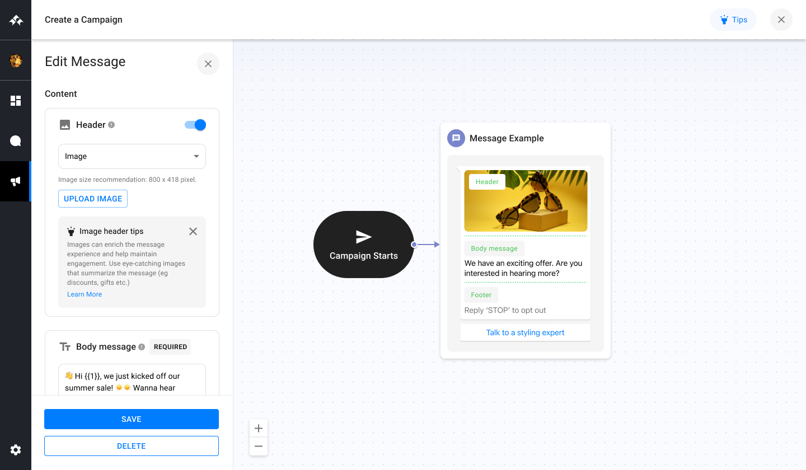

# WhatsApp Template Builder


## Overview

This project is a marketing automation tool designed to intuitively design and customize marketing campaigns for interacting with customers via WhatsApp. It features a template builder and message preview, allowing users to create and visualize WhatsApp templates with ease.

## Features

- **Template Sidebar and Message Preview**: Users can customize their initial messaging with interactive editing reflected in the message preview.
- **Interactive Components**: Includes text editing for the body message and buttons, with the ability to disable/enable optional components.
- **Mock Save Functionality**: While the save functionality is mocked, it's designed to interface seamlessly with a backend API for creating or updating message templates.
- **Responsive Design**: Ensures a smooth experience across various desktop screen sizes.

## Technologies Used

- **React**: For building the user interface.
- **Vite**: A modern frontend build tool that provides a faster and leaner development experience.
- **Node.js (v20.2)**: Used for backend services and API interactions.
- **Netlify**: For continuous integration and deployment.
- **TypeScript**: For adding static type definitions to JavaScript, enhancing development and maintainability.
- **useContext API**: For managing state across the application.
- **Jest**: For unit and integration testing, ensuring code quality and reliability.

## Getting Started

### Prerequisites

Ensure you have Node.js (v20.2 or later) installed.

### Installation

1. Clone the repository:
```bash
git clone https://github.com/jordaniodev/challenge-connectly
```

2. Install the dependencies:
```bash
cd challenge-connectly
npm install
```

3. Start the development server:
```bash
npm run dev
```

The application will be available at `http://localhost:3000`.

### Deployment

This project is deployed on Netlify for easy access and demonstration purposes. Visit [Demo](https://challenge-connectly.netlify.app/) to view the live application.

## Testing

Run the following command to execute the unit tests with Jest:
```bash
npm test
```

## Contributions

We welcome contributions to the project. Please open an issue or pull request to propose changes or additions.

## License

This project is licensed under the MIT License - see the LICENSE file for details.

## Test Results

Below are the results of the Jest unit tests executed for the project:

- `PASS` src/components/SideBar/SideBar.spec.tsx 
- `PASS` src/components/Header/Header.spec.tsx 
- `PASS` src/hooks/MessagePreview/useMessagePreview.spec.tsx 
- `PASS` src/components/Button/Button.spec.tsx 
- `PASS` src/components/CardTip/CardTip.spec.tsx
